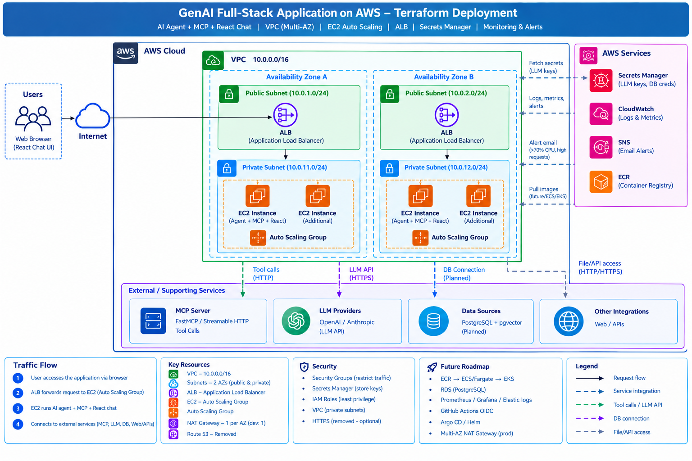
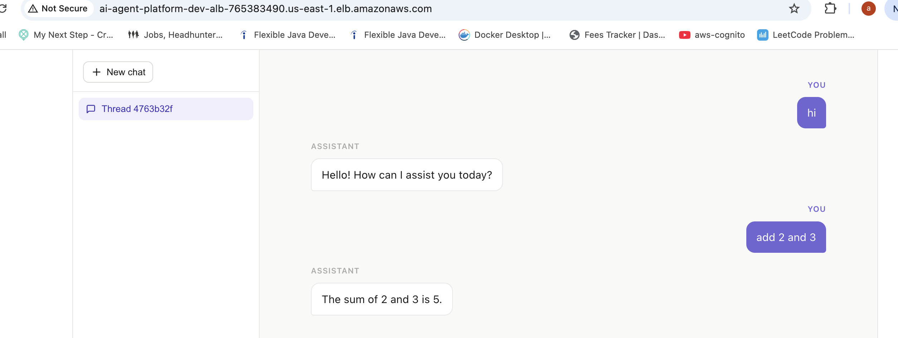
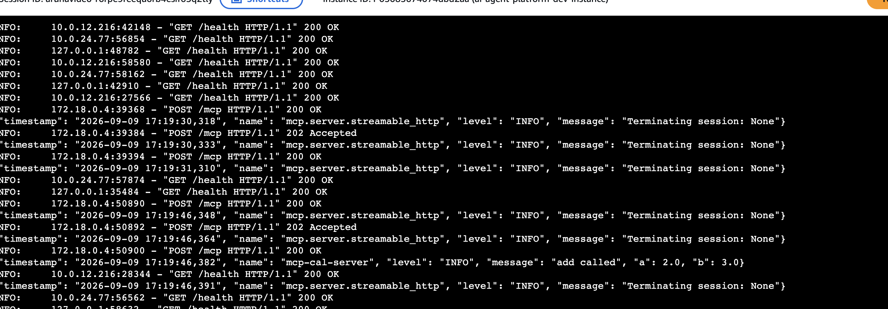

# AI Agent Platform on AWS (Multi-AZ, Auto Scaling, CloudWatch + SNS)

Deploys a Dockerized AI agent stack — chat frontend, AI agent backend, and MCP server — to EC2 across multiple Availability Zones, with Auto Scaling, CloudWatch monitoring, and SNS alerting.

Part of my Terraform + AWS learning journey.

## Architecture

```
Internet → ALB (multi-AZ, public subnets)
              │
              ▼
   Auto Scaling Group (private subnets, multi-AZ)
   ┌─────────────────────────────────────┐
   │  EC2 instance (Docker containers)     │
   │  ├── chat-fe        (frontend, :5173)  │
   │  ├── chat-be         (ai-agent, :8001)  │
   │  └── mcp-cal-server   (mcp-server, :8000)│
   └─────────────────────────────────────┘

  ECR (3 repos)   Secrets Manager   CloudWatch + SNS (CPU alarms → scale + email alert)
```
## Application
🔗 [GitHub Repository](https://github.com/awsaruna451/langgraph-chat-project/tree/dev)
## Modules

| Module       | Purpose                                                            |
|--------------|----------------------------------------------------------------------|
| `vpc`        | Multi-AZ VPC — public/private subnets across `az_count` AZs             |
| `security`   | Security groups: ALB (public), app (ALB-only)                             |
| `ecr`        | 3 ECR repos: `ai-agent`, `mcp-server`, `frontend`                            |
| `secrets`    | Secrets Manager entry with LLM/API keys (OpenAI, Google, OpenWeather, AlphaVantage) |
| `alb`        | Application Load Balancer + target group + HTTP/HTTPS listeners             |
| `asg`        | Launch template + Auto Scaling Group, multi-AZ, self-healing container deploy on boot |
| `monitoring` | CloudWatch CPU alarms wired to scaling policies + SNS email alerts           |

RDS (Postgres) is scaffolded in the module but currently commented out — not yet part of the live deployment.

## How deployment works

- **GitHub Actions (OIDC, no stored AWS keys)** builds and pushes each service's image to its ECR repo, then triggers a redeploy via **SSM Send-Command** on running instances.
- **Instance boot (`user_data`)** installs Docker, then runs the same deploy logic as CI — pulling the current `:latest` image for all three services and starting them as containers on a shared Docker network. This makes any freshly launched instance (scale-out, health-check replacement, instance refresh) self-healing and immediately correct, without waiting for the next push.

## Prerequisites

- Terraform >= 1.5
- AWS CLI configured
- An S3 bucket for Terraform remote state
- A GitHub OIDC-federated IAM setup (created by this config) so Actions can push to ECR and deploy via SSM
- (Optional) an ACM certificate for HTTPS on the ALB

## Usage

```bash
cd envs/dev   # or your environment folder
terraform init
terraform plan
terraform apply
```

After `apply`, push images to the three ECR repos (via GitHub Actions or manually) — the ASG's bootstrap script will pull and run them automatically on instance launch, and each subsequent push redeploys via SSM without replacing the instance.

## Monitoring

- **CPU-high** → scales out the ASG and sends an SNS email alert
- **CPU-low** → scales in
- **Unhealthy host count** → SNS alert if in-service instances drop below the configured minimum

## Notes

- Secrets (API keys) are pulled from Secrets Manager at container-start time — never baked into images.
- Multi-AZ applies to the VPC and the ASG; RDS Multi-AZ will apply once the database module is enabled.
- GitHub Actions authenticates via OIDC federation — no long-lived AWS access keys are stored in the repo.

## What I Learned

- Structuring a multi-service AI application (agent + MCP server + frontend) as independent containers on shared EC2 instances
- Self-healing instance bootstrap that mirrors the CI/CD deploy path, so boot-time and push-time deploys never drift apart
- Wiring CloudWatch alarms directly to Auto Scaling policies and SNS notifications
- GitHub Actions → AWS via OIDC, avoiding stored credentials entirely






