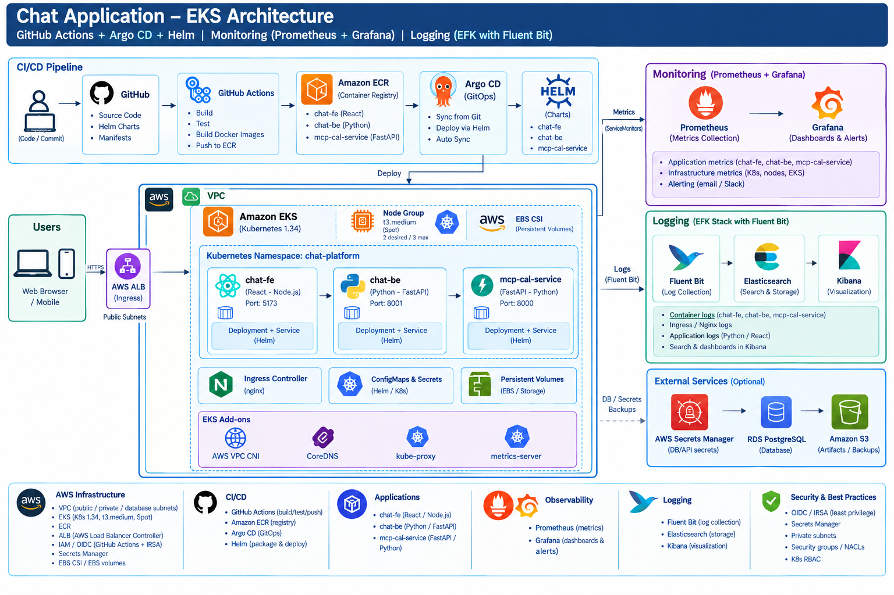
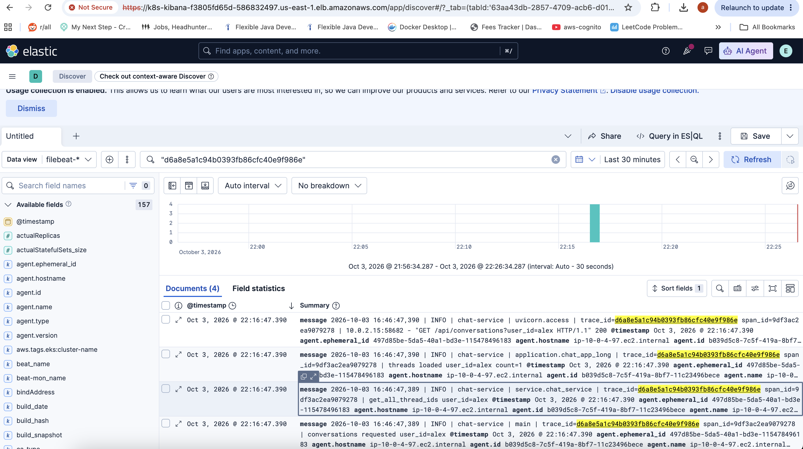
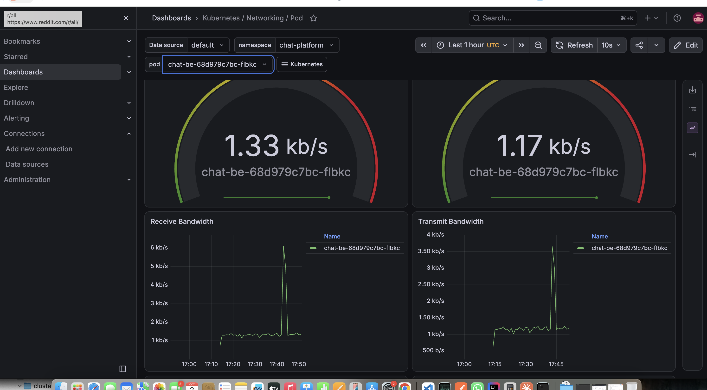
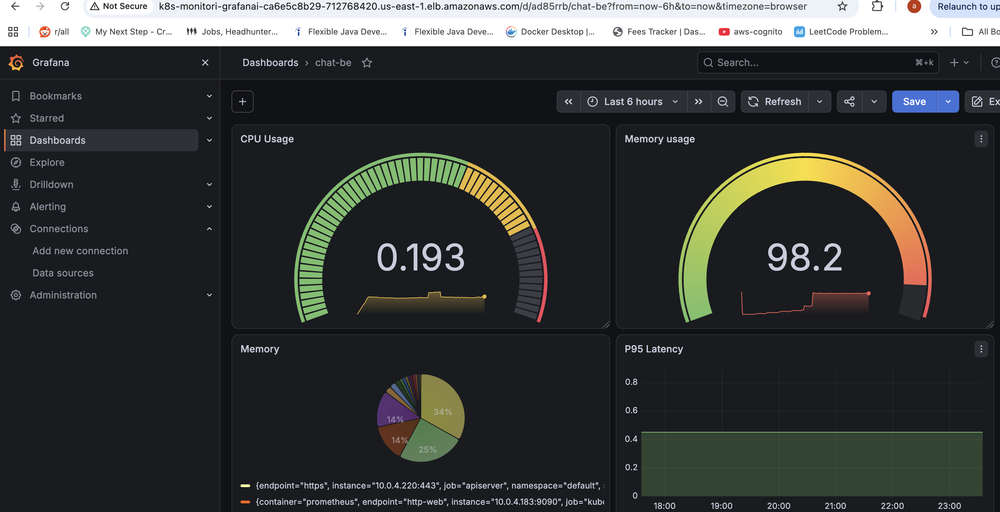
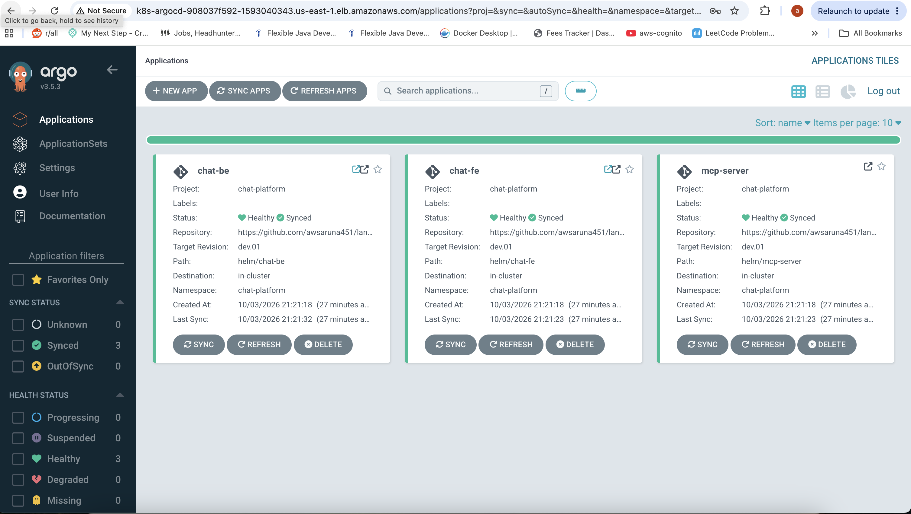

# AI Agent Platform — Chat Application on EKS

A GitOps-driven, Kubernetes-native AI chat platform: a React frontend, a Python/FastAPI agent backend, and an MCP tool server, deployed to Amazon EKS via GitHub Actions, Argo CD, and Helm — with Prometheus/Grafana for metrics and an EFK (Fluent Bit + Elasticsearch + Kibana) stack for centralized logging.

> **Day 4** of building this in public: moved from EC2 + SSM-based deployment to a full EKS + GitOps setup. See [Architecture](#architecture) below for the complete picture.

---

## Architecture



## Logs


## Monitoring




## GitOps


## 🔗 GitHub Code artifact
https://github.com/awsaruna451/langgraph-chat-project/tree/dev.01

**Deployment flow:**
```
GitHub → GitHub Actions → Amazon ECR → Argo CD → Helm → Amazon EKS
```

**Observability flow:**
```
Applications → Prometheus → Grafana          (metrics)
Applications → Fluent Bit → Elasticsearch → Kibana   (logs)
```

### Components

| Layer | Component | Purpose |
|---|---|---|
| **Compute** | Amazon EKS (Kubernetes 1.34) | Container orchestration, SPOT node group (`t3.medium`, 2–3 nodes) |
| **Networking** | VPC (public / private / database subnets), AWS ALB Ingress Controller | Isolated network, internet-facing ingress for each app |
| **CI** | GitHub Actions, OIDC → AWS | Build, test, and push images with no long-lived AWS credentials |
| **Registry** | Amazon ECR | One repository per service (`chat-fe`, `chat-be`, `mcp-cal-server`) |
| **CD** | Argo CD + Helm | Pulls from Git, renders Helm charts, auto-syncs to the cluster |
| **Frontend** | `chat-fe` — React (Node.js), port `5173` | Chat UI |
| **Backend** | `chat-be` — Python (FastAPI), port `8001` | AI agent backend |
| **Tools** | `mcp-cal-server` — Python (FastAPI), port `8000` | MCP server for tool integration |
| **Storage** | EBS CSI driver, Persistent Volumes | Stateful workloads (Elasticsearch data) |
| **Secrets** | AWS Secrets Manager + External Secrets Operator | API keys and DB credentials, never committed to Git |
| **Metrics** | Prometheus + Grafana | Application and infrastructure metrics, dashboards, alerting |
| **Logs** | Fluent Bit → Elasticsearch → Kibana | Centralized log collection, search, and visualization |
| **IaC** | Terraform | VPC, EKS, ECR, IAM, Secrets Manager — fully repeatable |

### EKS add-ons
`vpc-cni` (prefix delegation enabled) · `kube-proxy` · `coredns` · `eks-pod-identity-agent` · `aws-ebs-csi-driver`

---

## Repository layout

```
.
├── terraform/
│   └── environments/
│       └── dev/
│           ├── main.tf              # root module — wires vpc/eks/ecr/iam/secrets-manager + ALB controller
│           ├── variables.tf
│           └── terraform.tfvars
│   └── modules/
│       ├── vpc/
│       ├── eks/
│       ├── ecr/
│       ├── iam/                     # GitHub OIDC role, IRSA roles (ESO, LBC, EBS-CSI)
│       └── secrets-manager/
├── helm/
│   ├── chat-fe/values.yaml
│   ├── chat-be/values.yaml
│   └── mcp-server/values.yaml
├── chat-fe/                          # React app + Dockerfile
├── chat-be/                          # FastAPI agent backend + Dockerfile
├── mcp-cal-server/                   # MCP tool server + Dockerfile
└── .github/workflows/
    ├── _build-push-ecr.yml           # reusable: build → push to ECR → bump Helm values.yaml
    ├── chat-fe.yml
    ├── chat-be.yml
    └── mcp-cal-server.yml
```

---

## Prerequisites

- AWS account with permissions to create VPC, EKS, IAM, ECR, and Secrets Manager resources
- [Terraform](https://developer.hashicorp.com/terraform/downloads) ≥ 1.9
- `kubectl`, `helm`, `aws` CLI configured for the target account/region
- A GitHub repository with Actions enabled
- API keys for whichever external services the agent uses (OpenAI, Google, OpenWeather, Alpha Vantage, etc.)

---

## Getting started

### 1. Provision the infrastructure

```bash
cd terraform/environments/dev
terraform init
terraform plan   # review carefully — confirm no unintended destroys on repeat applies
terraform apply
```

This creates, in dependency order:
1. VPC (public/private/database subnets)
2. EKS cluster + SPOT node group + OIDC provider
3. IAM roles: GitHub Actions CI role (repo/branch-scoped trust policy), and IRSA roles for the EBS CSI driver and AWS Load Balancer Controller, keyed off the **real** EKS OIDC provider
4. ECR repositories (one per service)
5. Secrets Manager entries for DB credentials and third-party API keys
6. The AWS Load Balancer Controller, installed via `helm_release` directly in Terraform

> **IAM note:** the GitHub Actions role's trust policy is scoped to a specific `repo:<org>/<repo>:ref:refs/heads/<branch>` — not a wildcard — and the IRSA roles (ESO, EBS-CSI, Load Balancer Controller) only get created once `enable_irsa_roles = true` and a real `module.eks.oidc_provider_arn` exists. Bringing up EKS and these IAM roles together in one `apply` works because Terraform resolves dependencies at the resource level, not the module level — the cluster's OIDC provider resource is created before the IRSA roles need it, which are created before the Load Balancer Controller's `helm_release` needs *their* output.

### 2. Configure GitHub Actions

Add the IAM role ARN from the Terraform output as a repository secret:

```bash
terraform output -raw github_actions_role_arn
```
GitHub repo → **Settings → Secrets and variables → Actions** → `AWS_ROLE_ARN`

Also ensure **Settings → Actions → General → Workflow permissions** is set to "Read and write permissions" — the reusable workflow commits the Helm `values.yaml` tag bump back to the repo.

### 3. Install Argo CD

```bash
kubectl create namespace argocd
kubectl apply -n argocd -f https://raw.githubusercontent.com/argoproj/argo-cd/stable/manifests/install.yaml
```

Create an `Application` (or `ApplicationSet`) per service, pointing at `helm/<service>` in this repo, with automated sync enabled so a Helm `values.yaml` change deploys automatically.

### 4. Push code

```bash
git push origin dev
```

This triggers: build → push to ECR (tagged with the short commit SHA) → bump `image.tag` in the matching `helm/<service>/values.yaml` → commit back to Git → Argo CD detects the change and syncs.

---

## Accessing things

| What | How |
|---|---|
| **Chat app** | Via the ALB Ingress for `chat-fe` — `kubectl get ingress -n chat-platform` for the current hostname |
| **Grafana** | `kubectl port-forward -n monitoring svc/kube-prom-stack-grafana 3000:80`, login `admin` / `kubectl get secret -n monitoring kube-prom-stack-grafana -o jsonpath="{.data.admin-password}" \| base64 --decode` |
| **Prometheus** | `kubectl port-forward -n monitoring svc/kube-prom-stack-kube-prome-prometheus 9090:9090` |
| **Kibana** | Via its ALB Ingress — requires an HTTPS listener (see [Operational notes](#operational-notes)); `kubectl get ingress kibana -n logging` for the hostname |
| **Argo CD UI** | Via its ALB Ingress, or `kubectl port-forward -n argocd svc/argocd-server 8080:443` |

ALB-fronted services in this setup are typically locked down with `alb.ingress.kubernetes.io/inbound-cidrs` to specific IPs rather than left open to the internet — check each Ingress's annotations before assuming public access.

---

## Operational notes

A few non-obvious things learned operating this stack, worth keeping in mind:

- **ALB hostnames are not stable.** Any change to an Ingress's `backend-protocol`, `listen-ports`, or similar annotations causes the AWS Load Balancer Controller to provision a **new** ALB with a new random DNS suffix. Don't bookmark the raw hostname for anything long-lived — point a real Route 53 record at it instead.
- **PVCs with `WaitForFirstConsumer` stay `Pending` until a pod schedules onto a node** — that's normal, not a bug. If a PVC stays `Pending` indefinitely, check (in order): the EBS CSI driver controller is actually running (`kubectl get pods -n kube-system -l app=ebs-csi-controller`), the IRSA role backing it is valid, and the node group has free CPU/memory for the pod itself to schedule.
- **ECK-managed Kibana serves HTTPS by default** on its `kb-http` service, even though the port is named "http." The Ingress's `backend-protocol`/`healthcheck-protocol` must be `HTTPS` to match, or you'll get a 502.
- **Kibana's "secure connection required" login error** is a client-side check against the browser's own address-bar protocol — it requires the ALB to terminate real TLS facing the browser (port 443 with a cert), not just an HTTPS backend. With no domain available for a trusted ACM cert, a self-signed cert imported into ACM for the ALB's front-end listener works, at the cost of a one-time browser warning.
- **SPOT node groups can reclaim nodes without warning.** A `PersistentVolume` zone-locked to a now-gone SPOT node can leave a pod stuck in `FailedScheduling` with a volume-affinity conflict — deleting the stuck PVC/pod and letting the StatefulSet recreate them against a live node resolves it.
- **Commenting out a Terraform module doesn't just "pause" it** — the next `apply` will propose destroying every resource that module owns. Always run `terraform plan` and read it before applying after any module is added/removed from root config, especially for `vpc`/`eks`, which back a live cluster.

---

## Roadmap

- [x] EC2 + SSM-based deployment (previous iteration)
- [x] Move to EKS with GitOps (Argo CD + Helm)
- [x] GitHub Actions OIDC (no long-lived AWS credentials)
- [x] Prometheus + Grafana
- [x] EFK logging stack
- [ ] HTTPS via a real domain + ACM-validated certificate
- [ ] CI for pull requests (currently push-to-branch only)


